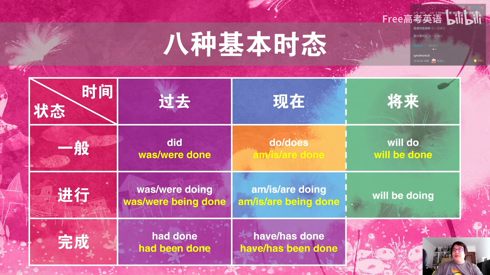

# Free-NMET


## The Fragments of Vocabulary

### 以天背单词

- `port` 港口 带

  import 进口  important 重要adj  importantly adv  importance n

  export 出口 

  airport 机场

  porter 搬运工  portage 搬运

  portable 可携带的adj  portability便携性n

  transport 运输  transportation n

  deport 放逐

  report 报告

  passport 执照

  support 支持  supporter 支持者  supporting 辅助性adj  supportive 给予支持的adj

  portion 一份n 分配v  proportion 份额  proportional 均匀的

  opportune 恰好的adj  opportunism 机会主义n  opportunity 机遇n

  

- `fect` `fit` 做

  defect 缺陷

  perfect 完美adj  perfection n

  effect 影响/效果  effctive 有效adj  effectiveness n

  affect 影响/感动  affection 感情n

  infect 感染v  infection n

  profit 收益  profitable adj

  benefit 益处  beneficial adj

  

- `spect` 看

  inspect 检查v  inspection n  inspector 检察员

  prospect 预期

  expect 期待  expectation 期待  unexpected 出人意料的

  suspect 怀疑  suspicious 怀疑的  suspicion 怀疑  suspected 有嫌疑的

  aspect 方面

  perspective 看法


### 易混单词梳理

- dessert desert dissert

  dessert 甜点n (ess 一只鹅两瓶水)

  desert 沙漠n 舍弃v (es 一只鹅一瓶水)

  dissert 论述v (iss 一支笔两瓶墨水)


- principal principle

  principal 校长n 主要的adj (all全部人中最突显的是校长)

  principle 准则n (l按照准则行事很快le)


- affect effect

  affect 影响 作用v ()

  effect 影响 效果n ()


- clash crash crush

  clash 冲突 (la上大炮)

  crash 撞车 (rao过)

  crush 压坏 (进ru里面)


## The Core of Vocabulary


## The Key about Grammar

- 语法：词法 + 句法

- 词法

  **名词**：可数名词单复数、不可数名词、专有名词、名词所有格

  **动词**：基本形式、及物和不及物、系动词、助动词、情态动词

  **形容词**：基本形式、比较级和最后高级

  **副词**：基本形式、比较级和最高级

  代词：人称代词、物主代词、反身代词、指示代词、不定代词、疑问代词

  数词：基数词、序数词

  其他词性：介词、连词、冠词、感叹词

  构词法：合成、派生、转化、缩写简写

- 句法 

  句子种类：陈述句、疑问句、祈使句、感叹句

  句子结构成分：名词短语、动词短语、形容词短语、副词短语、介词短语

  句子功能成分：主语、谓语、宾语/补语、状语、表语、定语

  基本句型：主`谓`、主`系`表、主`谓`宾、主`谓`宾宾、主`谓`宾补、主`谓`状、主`谓`宾状、其他句型

  **时态语态**：一般现在/被动、一般过去/被动、一般将来/被动、现在进行/被动、过去进行/被动、将来进行、现在完成/被动、过去完成/被动、过去将来、现在完成进行

  **非谓语**：不定式、-ing形式、-ed形式

  **并列复合句**：连词、连词短语

  **主从复合句**：宾语从句、状语从句、定语从句、主语从句、表语从句、同位语从句

  **其他现象**：主谓一致、省略、倒装、强调、虚拟语气

  


- 语法考点

  语法填空 (可考察的语法点)

  文章写作、阅读理解 (写句子 读句子)

  


### 动词时态语态

- 定位

  动词是句子的最核心

  8 + 2 + 1

  

- 八种基本时态

  

  时间 (过去 现在 将来) + 状态 (一般 进行 完成)

  一般过去 (`did`, `was/were done`)、**一般现在** (`do/does`, `am/is/are done`)、一般将来 (`will do`, `will be done`)

  过去进行 (`was/were doing`, `was/were being done`)、现在进行 (`am/is/are doing`, `am/is/are being done`)、将来进行 (`will be doing`)

  过去完成 (`had done`, `had been done`)、现在完成 (`have/has done`, `have/has been done`)

- 特殊

  **一般现在**：不强调时间、普遍状况

- 过去时间

  **一般过去**：强调过去、普遍状况

  **过去进行**：强调过去、正在发生 (生动场景感)

  **过去完成**：强调过去、已经完成 (在过去之前)

  **现在完成**：强调过去到现在、动作结果

- 其他基本时态

  **现在进行**：强调现在、正在发生 (生动场景感)

  **一般将来**：强调将来、普遍状况

  **将来进行**：强调将来、正在发生 (生动场景感)

- 现在时态表将来 (虚线)

  **一般现在表将来**：主将从现(条件句)

  **现在进行表将来**：特殊动词(go / come / open / close / die ...)

  


- 两种特殊时态

  

  时间 + 时间；状态 + 状态

- **过去将来** (`would do`)：强调过去和将来、在过去说将来的动作 

- **完成进行** (`have/has been doing`)：强调过去到现在、正在发生 (最近一直)

  


- 一个附加考点

  

- 虚拟语气

  


### 非谓语动词

- 定位

  3 + 6 + 1


## The Analyse to Complex Sentences


## The Season of Summer Learning

### 语法


### 完型

- 考察：单词认知、解题思路、篇章理解 (完型不考语法)

- 解题思路 (不管文章怎么变 考点分布)

  > (萃取问题)
  >
  > **动词**：**动作顺序**、**动词名词**；动词副词
  >
  > **名词**：**相关内容**、**名词动词**；名词形容词
  >
  > **形副**：**感情色彩**；形容词名词、副词动词
  >
  > 连词：上下文逻辑关系
  >
  > 介词：动词短语、介词短语

  ```
  动词名词相互制约
  
  动作收到名词的制约
  我__饭：吃
  我__足球：吃x 踢
  我__英语：踢x 学
  厨师__饭：做
  
  
  完型的文章词汇不认识没关系
  选项词汇是核心词汇必须认识
  
  ```
  
  


#### practice1

- 11 动词：动作顺序、动词名词 (文章的情节靠动作往前推动)

  依据

  前面动作：was lucky、would let him slip
  
  动词名词：
  
- 选项

  keep 不幸运
  
  fight 不幸运
  
  defend/protect 保卫 **+ 保护对象**  (不要受中文模糊的影响  抵御 + 反对对象)
  
  escape 逃脱寒冷 幸运 ✔


- 12 名词：相关内容

  依据

  相关内容：shared with six family members、roadblocks

- 选项

  delivery 发送 **位置转换**

  danger 危险 **危及生命**

  power 能量力量

  lack 缺乏 ✔


- 13 具体名词：一定会有重复现象

  依据

  相关内容：clinic 诊所、doctor

- 选项

  doctor ✔


- 14 动词：动作顺序

  依据

  动作顺序：decided、move  决定__舒适生活 搬到美国去\_\_机会

- 选项

  lead 带领  (lead a happy lift 过着幸福的生活)  和move矛盾

  adopt 领养

  continue 继续  和move矛盾

  leave 离开 ✔

- 核心词汇

  ```
  lead - led
  
  `24`
  admit 1 承认 **受迫**  2 允许进入 admission ticket
  adapt 适应 改编 adaptation **变化**
  adjust 调整 **变化/程度弱**
  adopt sth 接受 采纳  adopt sb 领养
  accept sth 接受某物  accept sb 接受某人 **好感** 
  
  ```


- 15 动词：动作顺序

- 选项

  check 检查 **是否** 

  appreciate 欣赏 感谢

  predict **+ 将来没发生**

  seek 寻找 ✔

- 核心词汇

  ```
  `44`
  check **是否**
  examine **内在问题** (检修机器 体检)
  
  `85`
  写作感谢 
  Thank you very much! 口语 非书面语
  I would like to express my heartfelt gratitude to your help. 书面语
  express 	my 	sincere 	appreciation 
  show 		my 	great 		gratitude 
  deliver 	my 	heartfelt 	gratefulness
  动词				形容词		名词 (感谢)
  
  感谢
  appreciate v  appreciation n
  gratitude n
  grateful adj  gratefulness n
  
  
  寻找
  seek / look for / search for + sth
  search **+ 位置** 搜索某处
  I am searching Mr. Wang. 搜王老师的身 x
  I am searching for Mr. Wang. 找王老师 v
  seek - sought
  ```


- 16 名词：相关内容

  依据

  相关内容：离开舒服的生活；sacrifices、also、like my father

- 选项

  sacrifice 牺牲  ✔

  talent 才华  没有文字描写父亲的才华

  instruction 指导  父亲教别人做事

  preparation 准备  父亲做准备/目标


- 17 形容词：正负态度

  依据

  familiar 中 熟悉的、sacrifice 正->负

  from ... to ... 变化 前后变化

  shood out 脱颖而出

- 选项

  enjoyable 正

  admirable 正 令人钦佩

  developing 中 
  
  challenging 负  ✔


- 18 名词

  依据

  相关内容：尽管 做出牺牲 没有__

- 选项

  regrets 后悔 ✔

  ideas 没有对应内容

  concerns 担忧 没有对应内容


- 19 名词

  依据 

  endless 无限的

  excel(超越) and interact with students from many backgounds

- 选项

  gifts 

  opportunities ✔


- 20 名词

  依据

  相关内容：and、my friends；living five minutes from school

- 选项

  relief **负->正** 如释重负

  comfort 住离学校五分钟 ✔


- 21 名词

  依据

  相关内容：purse rigorous courses、pushes me

- 选项

  drive ✔

  award 奖励

  duty 职责 

  turn 回合


#### practice2


#### practice3


#### practice4


#### practice5


### 阅读


### 七选五


## The Season of Autumn Education


## The Season of Winter Studies


## The Season of Spring Instruction


## Writing Practice

- Purpose

  主观题：写烂套路、分析内容、核心语料

  客观题：核心词汇


### 0521 发言稿类应用文

- 0521 发言稿类应用文

  > 假定你是李华，英语老师安排你今天做课前演讲，你打算谈谈上周班内英语辩论赛，内容包括：
  >
  > 1.你的观感；
  >
  > 2.你的建议。

  


- Analyse (表意正确 逻辑合理)

  演讲 -> 发言(头尾)

  观感：好(好写)、坏、没感觉 -> 好在哪

- Structure

  **分析具体问题的套话** + (语料)`动词短语` + `形容词替换` + *具体名词内容替换* 

  套话：开头(总括), 结尾(总结 展望期待) 

  内容：观感很好、哪里好；

  内容：建议，有些地方还能更好(建议给谁听  辩手 观众 组织者)

  

---

- 开头结尾

  **I'd like to share my thoughts and suggestions on** our English debate last week. [总括]

  **In conclusion**, the debate **is a great success**, and **I hope we can make future** debates **even more** `effective` and `enjoyable`. Thank you! [总结 展望]

  形容词替换：`professional`

- 观感部分 (过去)

  观感好，好在哪里？闪光点！

  **I must say I was impressed by** `the high level of English expression` and `logical thinking` of the debaters. [闪光点  英文水平 逻辑思维]

  Their `arguments and evidence` were `well-prepare and covincing`. [闪光点  观点论据 准备充分 说服力]

  **This event not only** `practiced their language skills` **but also** `strengthens the team spirit`. [闪光点  活动作用(语言技能 团队精神)]

  随便组合

  **I must say I was impressed by** their `arguments and evidence`, which were `well-prepare and covincing`. 

- 建议部分

  **Besides**, **I also have some suggestions for future** debates. [建议总括句]

  **One is for** the debaters, I think gathering more statistics from more diverse sources will further enhance their arguments. 

  **The other is for** the audiences, 

  

---


- Show

  I'd like to share my thoughts and suggestions on our English debate last week. 

  I must say I was impressed by the high level of English expression and logical thinking of the debaters. Their arguments and evidence were well-prepare and covincing. This event not only practiced their language skills but also strengthens the team spirit. 

  In conclusion, the debate is a great success, and I hope we can make future debates even more effective and enjoyable. Thank you! 


