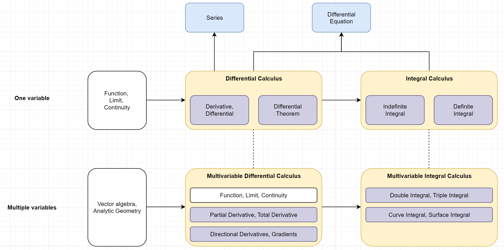
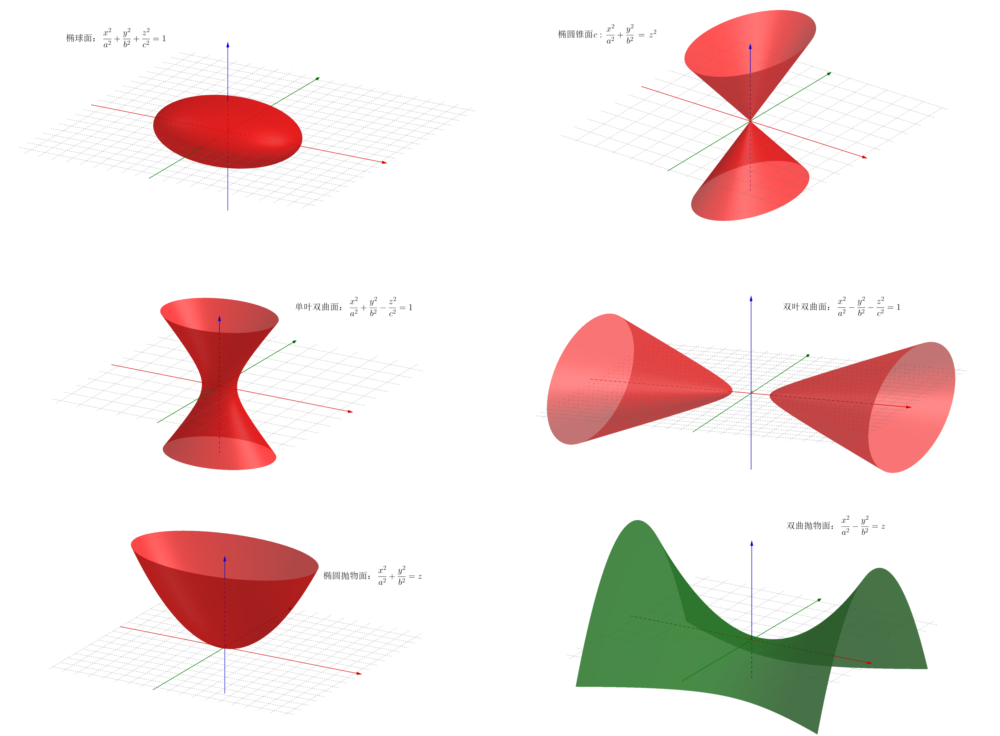

# calculus

- Reference

  [GeoGebra](https://www.geogebra.org/classic?lang=zh_CN), 

  [quadric surface(blog)](https://zhuanlan.zhihu.com/p/527203218), 

- Overview

  

​	

# calculus (dekuang su)

## Functional, Limit, Continuity

## Derivative and Differential

## Differentiation Theorem

- Overview

- Differential mean value theorem

  Rohr's theorem, Lagrange's mean value theorem, Cauchy's theorem

  

### Differential mean value theorem

- Concept

#### Fermat Lemma

#### Rolle's theorem

#### Lagrange's mean value theorem

#### Cauchy's theorem

### Calculation limit

### Application of Differential mean value theorem

### Taylor Formula

#### Computed function value

#### Taylor Formula

#### McLaurin Presentation

### Application of Taylor Formula

### Convexity, Inflection and Curvature

## Indefinite Integral

### Basic concepts

### Four calculation methods

### Three types of indefinite integrals

## Definite Integral

### Basic concepts

- 引入

  Q：求曲边梯形的面积 (连续曲线(>=0) 与x=a, x=b, x轴围成的)

  实际问题：测量土地

  基本思路：无法直接求精确值 <- 先求近似值 再无限接近地 取极限

- 四部曲
  $$
  \text{Step 1 分割: } \space
  在[a,b]内插入n-1个点，st.a<x_1<x_2<...<x_{n-1}<b; a=x_0, b=x_n
  \\
  把[a,b]分成n个小区间[x_0,x_1],[x_1,x_2],...[x_{i-1},x_i],...[x_{n-1},x_n]
  \\
  记x_i-x_{i-1}=\Delta x_i; (i=1,2,..n); 
  \\
  相应地，把曲边梯形分成n个：\Delta S_1,\Delta S_2,...,\Delta S_i,...,\Delta S_n
  
  \\
  \text{Step 2 取近似: } \space
  由f(x)连续 \Rightarrow 当\Delta x \to 0，有\Delta y \to 0 (曲边梯形近似矩形);
  \\
  \forall \xi_i \in [x_{i-1},x_i]，得某小矩形的高为f(\xi_i)
  \\
  则曲边梯形的面积\Delta S_i \approx f(\xi_i) \Delta x_i; (i=1,2,...,n) 
  
  \\
  \text{Step 3 求和: } \space
  S = \Delta S_1 + \Delta S_2 + ... + \Delta S_n \approx \sum_{i=1}^{n} f(\xi_i)  \Delta x_i
  
  \\
  \text{Step 4 取极限: } \space
  记\lambda = max\{ \Delta x_i : 1 \le i \le n \}，
  则\lim_{\lambda \to 0} \sum_{i=1}^{n} f(\xi_i)  \Delta x_i = S
  $$
  

## Differential equations

## Series

### Fourier expansion of a function

## Spatial Analytic Geometry

### Quadric Surface

- 图形

  

## Differential of multiple functions

## Integral of multiple functions

- 本质

  第一类曲线积分 -> 一重积分

  第一类曲面积分 -> 二重积分

- 可以把一个物体视为

  很细的细棒(`一重积分`)、平面薄片(`二重积分`)、立体(`三重积分`)

  曲线段(`第一类曲线积分`)、曲面块(`第一类曲面积分`)

- 引入问题

  求细棒的点密度(`一重积分`)、求平面薄片的面密度(`二重积分`)、求立体的体密度(`三重积分`)

  求曲线的质量(`第一类曲线积分`)、求曲面的质量(`第一类曲面积分`)

- 能够解决不能直接

  求立体的体积、求平面图形的面积

  求曲线的弧长(高维)、求曲面的面积
  
  

- 被积函数化简问题

  二重积分 三重积分 X (点坐标满足的是不等式)

  曲线积分 曲面积分 ✔ (点坐标满足的是等式方程)n

### Double integral

### Triple integral

### Curve integral of the first kind

#### Basic conception

- 引入：已知曲线的线密度，求该曲线的质量

  $$
  设一条曲线 \Gamma_{AB},\space \forall P \in \Gamma_{AB},\space st. P \in \stackrel\frown{MN} \subset \Gamma_{AB}
  \\
  设\stackrel\frown{MN}的弧长为 \Delta s,\space \stackrel\frown{MN}的质量为 \Delta M,\space 则\frac{\Delta M}{\Delta s}称为\stackrel\frown{MN}的平均(线)密度
  \\
  若\lim_{\stackrel\frown{MN} \to P} \frac{\Delta M}{\Delta s} = \lim_{\Delta s \to 0} \frac{\Delta M}{\Delta s}存在,\space 
  则该极限值称为\Gamma_{AB}在P点的(线)密度
  $$
  
- 曲线段一点的线密度
  $$
  若\Gamma_{AB}每一点的密度均相等，称该曲线是密度均质的曲线;\space
  设密度为\mu_0，弧长为s，质量为M，有\frac{M}{s}=\mu_0 \Rightarrow M = s \mu_0;\space
  否则称曲线\Gamma_{AB}密度是非均质的
  
  \\
  若\Gamma_{AB}在曲线上点P的密度为\mu=f(p)，函数连续，求\Gamma_{AB}的质量M
  $$
  
- 四部曲推导 (考虑非均质)
  $$
  \text{Step 1 分割: } \space
  相应地分成n个弧段\stackrel\frown{M_{i-1}N_i},\space
  弧长记为\Delta S_i;\space (i=1,2,...,n);\space
  \lambda=max\{ \Delta s_i : 1 \le i \le n \}
  
  \\
  \text{Step 2 取近似: } \space
  \forall P_i \in \stackrel\frown{M_{i-1}N_i},\space
  \Delta M_i \approx f(\xi_i) \Delta s_i; (i=1,2,...,n) 
  
  \\
  \text{Step 3 求和: } \space
  M = \Delta M_1 + \Delta M_2 + ... + \Delta M_n \approx \sum_{i=1}^{n} f(\xi_i)  \Delta s_i
  
  \\
  \text{Step 4 取极限: } \space
  记\lambda = max\{ \Delta x_i : 1 \le i \le n \}，
  则\lim_{\lambda \to 0} \sum_{i=1}^{n} f(\xi_i)  \Delta x_i = S
  $$

- 下定义 (去除叙述 保留表达式)

  条件要弱：保证和式极限存在且唯一(不必连续 不必>=0)；有界 可积
  $$
  
  $$
  

#### Properties

- 什么样的函数在 $\Gamma_{AB}$ 上可积

- 定理 (可积的充分条件)
  $$
  
  $$

- 物理意义 (第一类曲线积分)
  $$
  
  $$

- 性质

  第一类曲线积分 具有二重积分的所有性质

- 分类 

  平面第一类曲线积分 空间第一类曲线积分 
  $$
  
  $$
  第一类曲线积分 可以用来求 *曲线弧长(平面或空间)*

  

#### Calculate

- 计算平面第一类曲线积分 (化作一元函数定积分)

  参数方程化

  找到参数区间

  化作参数区间上的一元函数定积分
  $$
  
  $$
  四个具体变种
  $$
  
  $$
  

- 计算空间第一类曲线积分 
  $$
  
  $$
  

---

- Example
  $$
  
  $$
  

### Surface integral of the first kind

### Curve integral of the second kind

### Surface integral of the second kind

# MIT18.01-Single-Variable-Calculus

- Overview

- Unit 1: Differentiation

  A: What is a derivative? 

  - geometric interpretation, physical interpretation; 
  - importance of derivative to all measurements (science, engineering, economics, politcal science, etc)

  B: How to differentiate any function you kown? 

# MIT18.02-Multi-Variable-Calculus

# MIT18.03-Fifferential-Equations

