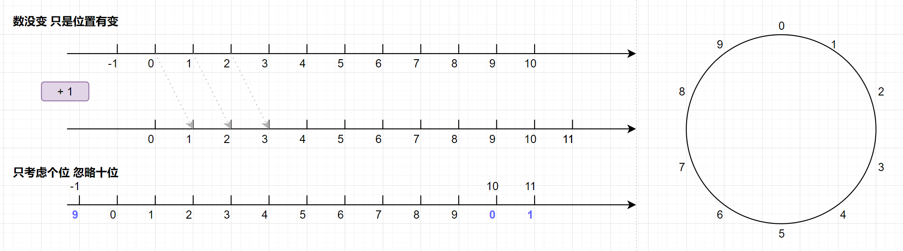
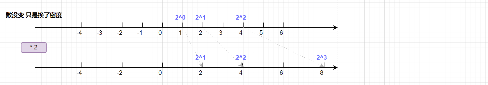
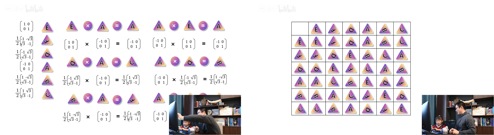
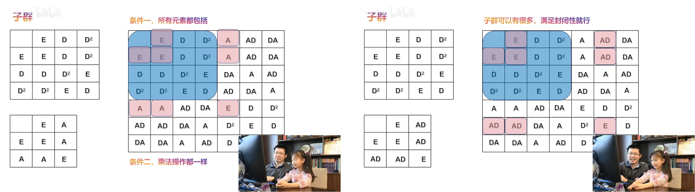
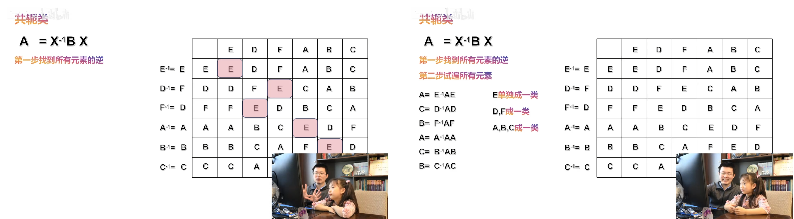
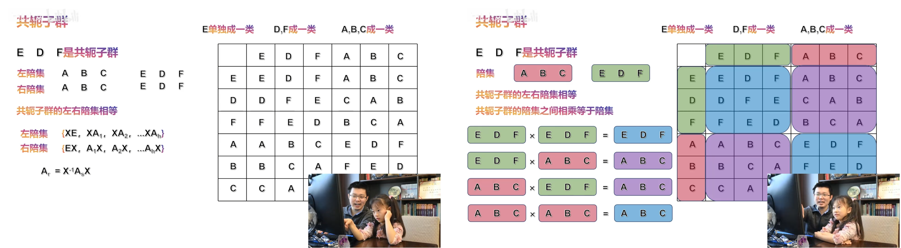

# linear-algebra

- Reference

  [MIT18.06-linear-algebra (Gilbert Strang)](https://web.mit.edu/18.06/www/)


- Overview

  Vector spaces

  Linear transformations

  Orthogonality

  Eigen-analysis


## Prepare

### System of linear equations

- Three ways to express the equation
  $$
  \text{Linear Equation: }
  
  \left\{\begin{matrix}
  2x_1 + x_2 = 7 \\
  -3x_1 + 4x_2 = -5
  \end{matrix}\right.
  
  \\
  
  \text{Vector Equation: }
  
  \begin{bmatrix}
  2x_1 + x_2 \\
  -3x_1 + 4x_2
  \end{bmatrix}
  =
  \begin{bmatrix}
  7 \\
  -5
  \end{bmatrix}
  
  \Longrightarrow
  \\
  
  \begin{bmatrix}
  2x_1 \\
  -3x_1
  \end{bmatrix}
  +
  \begin{bmatrix}
  x_2 \\
  4x_2
  \end{bmatrix}
  =
  \begin{bmatrix}
  7 \\
  -5
  \end{bmatrix}
  
  \Longrightarrow
  
  x_1
  \begin{bmatrix}
  2 \\
  -3
  \end{bmatrix}
  +
  x_2
  \begin{bmatrix}
  1 \\
  4
  \end{bmatrix}
  =
  \begin{bmatrix}
  7 \\
  -5
  \end{bmatrix}
  
  \\
  
  \text{Matrix Equation: }
  
  \begin{bmatrix}
  2& 1\\
  -3& 4
  \end{bmatrix}
  \begin{bmatrix}
  x_1 \\
  x_2
  \end{bmatrix}
  =
  \begin{bmatrix}
  7 \\
  -5
  \end{bmatrix}
  
  \Longrightarrow
  
  AX=b
  $$
  
- Need definition: Basis vector operations
  $$
  \text{Vector addition:} \space
  
  \begin{bmatrix}
  2 \\
  -3
  \end{bmatrix}
  +
  \begin{bmatrix}
  1 \\
  4
  \end{bmatrix}
  =
  \begin{bmatrix}
  3 \\
  1
  \end{bmatrix}
  
  \\
  
  \text{Scalar multiplication:} \space
  
  3
  \begin{bmatrix}
  2 \\
  -3
  \end{bmatrix}
  =
  \begin{bmatrix}
  6 \\
  -9
  \end{bmatrix}
  
  \\
  \Longrightarrow
  \text{Linear combination of columns:} \space
  3 col_1 + 1 col_2 = 
  \begin{bmatrix}
  7 \\
  -5
  \end{bmatrix}
  $$

- Need definition: Matrix-vector Multiplication
  $$
  \text{By rows (to linear eqs):}
  
  \begin{bmatrix}
  2& 1\\
  -3& 4
  \end{bmatrix}
  \begin{bmatrix}
  x_1 \\
  x_2
  \end{bmatrix}
  =
  \begin{bmatrix}
  2x_1 + x_2 \\
  -3x_1 + 4x_2
  \end{bmatrix}
  
  \\
  
  \text{By columns (to vector eqs):}
  
  \begin{bmatrix}
  2& 1\\
  -3& 4
  \end{bmatrix}
  \begin{bmatrix}
  x_1 \\
  x_2
  \end{bmatrix}
  =
  x_1
  \begin{bmatrix}
  2 \\
  -3
  \end{bmatrix}
  +
  x_2
  \begin{bmatrix}
  1 \\
  4
  \end{bmatrix}
  $$
  


---

- Two types of picture

  Row picture: find intersection

  Column picture: find coefficient!!!


# MIT18.06 (Gilbert Strang)

## Part 1

### The Geometry of Linear Equations


### Elimination with Matrices


### Multiplication and Inverse Matrices


### Factorization into A = LU


### Transposes, Permutations, Spaces R^n


### Column Space and Nullspace 


### Solving Ax = 0: Pivot Variables, Special Solutions 


### Solving Ax = b: Row Reduced Form R


### Independence, Basis, and Dimension 


### The Four Fundamental Subspaces


### Matrix Spaces; Rank 1; Small World Graphs


### Graphs, Networks, Incidence Matrices


### Quiz 1 Review


## Part 2

### Orthogonal Vectors and Subspaces


### Projections onto Subspaces


### Projection Matrices and Least Square


### Orthogonal Matrices and Gram-Schmidt


### Properties of Determinants


### Determinant Formulas and Cofactors


### Cramer's Rule, Inverse Matrix, and Volume


### Eigenvalues and Eigenvectors


### Diagonalization and Powers of A 


### Differential Equations and exp(At)


### Markov Matrices; Fourier Series


### Quiz 2 Review 


## Part 3

### Symmetric Matrices and Positive Definiteness


### Complex Matrices; Fast Fourier Transform 


### Positive Definite Matrices and Minima 


### Similar Matrices and Jordan Form


### Singular Value Decomposition


### Linear Transformations and Their Matrices 


### Change of Basis; Image Compression


### Quiz 3 Review


### Left and Right Inverses; Pseudoinverse


### Final Course Review


# MIT18.065-Linear-Algebra-and-Learning-from-Data


# linear-algebra (zhicheng zhou)

## Prepare

### System of linear equations


### Elimination


### Elimination using matrix multiplications


### Matrix algebra


### Inverse matrix


### Factorization A=LU


### Block matrix


## Vector spaces

### Vector space and subspace


### Column space and nullspace


### Reduced row echelon form


### General solutions to Ax=b


### Properties of vector space


### Four fundanmental subspace of A


## Linear transformations

### Introduction to linear transformations


### Language of transformations


## Orthogonality


## Eigen-analysis


# linear-algebra (nina)


# abstract-algebra (nina)

- Algebra

  Classical Algebra: 研究线性方程

  Modern Algebra: 研究代数系统 代数结构证明 (1900)

  


- 抽象代数的研究对象

  群 环 域 (集合 运算 公理)

  所谓的群环域，就是一个集合，上面有着运算，运算满足一定的公理性的条件

  `群`是最基本的代数结构：不涉及运算的交换性

  `环`是群的推广：引入了第二个运算(乘法)，但乘法不一定要求有单位元或逆元

  `域`是环的特化：要求加法和乘法都是阿贝尔群，且乘法除了0以外每个元素都有逆元

- Group
  $$
  群：一个集合G，配合一个二元运算（通常记作乘法或加法），满足以下四个条件：
  \\
  封闭性：对于\forall a,b \in G，有a⋅b \in G
  \\
  结合律：对于\forall a,b,c \in G，有a⋅(b⋅c)=(a⋅b)⋅c
  \\
  单位元：对于\forall a \in G，\exists e，有e⋅a=a⋅e=a
  \\
  逆元：对于\forall a \in G，\exists a^{-1}，使得a⋅a^{-1}=a^{-1}⋅a=e
  $$

- Ring
  $$
  环：一个集合R，配合两个二元运算：加法（+）和乘法（×），满足以下条件：
  \\
  加法满足群的所有条件，即封闭性、结合律、存在加法单位元（记作0）和每个元素都有加法逆元
  \\
  乘法满足封闭性、结合律；不要求乘法有单位元或每个元素都有乘法逆元；额外要求一个分配律
  \\
  分配律：\forall a,b,c \in R，有a×(b+c)=(a×b)+(a×c)，且(b+c)×a=(b×a)+(c×a)
  $$

- Field
  $$
  域是一个特殊的环，它满足以下条件：
  \\
  域的加法部分是一个Abel Group (交换群)
  \\
  域的乘法部分是一个Abel Group，且除了0以外，每个元素都有乘法逆元
  \\
  乘法对加法满足分配律
  $$
  


- 历史而来

  Van Der Waerden: *Modern Algebra*

  Galois: 多项式方程根式可解 的充要条件是 对应的Galois群是可解群 (把群论和域论完美结合 解决古典问题)

  


## Basic conception

- 运算

  以前运算：a+b, a-b, a*b, a/b

  定义运算(映射)、定义**二元运算**(映射 有且只有 运算封闭)

  - 有且只有：有，二元运算有结果 (+运算封闭)
  - 有且只有：只有，二元运算只有一个确定的结果

  $$
  Recall: 有非空集合A,B，存在映射f:A \to B，即\forall a \in A，\exists b \in B (且b唯一)，使得f(a)=b
  \\
  Define: 有非空集合S，S上一个二元运算是一个映射，*:s·s \to s；记*(a,b)=a*b
  \\
  Remark: *是有定义的(well-defined)，即\forall a,b \in S，\exists c \in S (且c唯一)，使得a*b=c
  \\
  Remark: 要求集合S对运算*是封闭的，即\forall a,b \in S，有a*b \in S
  $$

  Example
  $$
  
  $$

- 群 (四个公理条件)

  运算封闭 + 结合律 单位元 逆元
  $$
  
  $$
  Example
  $$
  
  $$
  


# abstract-algebra (ssxy-mini)

## 置换操作

- Example: 正三角形 (1,2,3)

  (1,2,3)  不旋转

  (3,1,2)  中心旋转 $\frac{2\pi}{3}$ 

  (2,3,1)  中心旋转 $\frac{4\pi}{3}$ 

  (2,1,3)  3轴旋转 $\pi$ 

  (3,2,1)  2轴旋转 $\pi$ 

  (1,3,2)  1轴旋转 $\pi$ 

  旋转操作：把三个点位置重新排列，称之为 `置换`

  


---

- Example: 两根 (1,2)

  二根置换有 $2$ 个元素

  ```
  (1,2)  
  (2,1)  
  ```

- Example: 三根 (1,2,3)

  三根置换有 $2*3=6$ 个元素

  ```
  (,1,2), (1,,2), (1,2,)
  (,2,1), (2,,1), (2,1,)
  ```

- Example: 四根 (1,2,3,4)

  四根置换有 $6*4=24$ 个元素

  ```
  (,3,1,2), (3,,1,2), (3,1,,2), (3,1,2,)
  (,1,3,2), (1,,3,2), (1,3,,2), (1,3,2,)
  (,1,2,3), (1,,2,3), (1,2,,3), (1,2,3,)
  
  (,3,2,1), (3,,2,1), (3,2,,1), (3,2,1,)
  (,2,3,1), (2,,3,1), (2,3,,1), (2,3,1,)
  (,2,1,3), (2,,1,3), (2,1,,3), (2,1,3,)
  ```

  


## 群的四个性质

- 群的构成

  集合 + 运算 + 公理

- 群的乘法

  置换群的乘法为 置换操作

  旋转群的乘法为 旋转操作

  


---

- 群的四个性质

- **封闭性**：任意两个元素的乘，仍是群内元素
  $$
  (3,1,2)*(3,1,2)=(2,3,1)
  
  \\
  
  (2,3,1)*(2,3,1)=(3,1,2)
  $$

- **结合性**：乘没有顺序 $(A*B)*C=A*(B*C)$ 
  $$
  (3,1,2)*(3,2,1)*(2,1,3)=(2,1,3)*(2,1,3)=(1,2,3)
  
  \\
  
  (3,1,2)*(3,2,1)*(2,1,3)=(3,1,2)*(2,3,1)=(1,2,3)
  $$
  

  群乘法 没有交换性 (交换不一定成立)
  $$
  \text{逆元可交换：}
  
  (3,1,2)*(2,3,1)=(1,2,3)
  
  \\
  
  (2,3,1)*(3,1,2)=(1,2,3)
  
  \\
  
  \text{普通元不可交换：}
  
  (3,1,2)*(2,1,3)=(1,3,2)
  
  \\
  
  (2,1,3)*(3,1,2)=(3,2,1)
  $$

- **恒元**：对任意元素A，存在单位元 $E$，st $A*E=A$
  $$
  (1,2,3)=E
  
  \\
  
  \text{表达含义即：不旋转}
  $$
  
- **逆元**：对任意元素A，存在A的相反元 $A^{-1}$，st $A*A^{-1}=E$
  $$
  \text{Example: }
  
  (3,1,2)*(2,3,1)=(1,2,3)
  
  \\
  
  \text{表达含义即：中心旋转120 * 中心旋转240 = 旋转回去}
  
  \\
  
  \text{Example: }
  
  (2,1,3)*(2,1,3)=(1,2,3)
  
  \\
  
  \text{表达含义即：3轴旋转180 * 3轴旋转180 = 旋转回去}
  $$
  
  
  


## 群有哪些 (群乘)

- Example：将**整数加法**定义为群乘

  构成`整数群`

  封闭性 ✔  结合性 ✔  恒元 ✔  逆元 ✔

- 对应平移操作 (*数没变 只是位置有变*)

  只考虑个位，忽略十位忽略负数，即$9+1=0$  $\Longrightarrow$  10个元素构成**循环群** (对应正多边形的旋转)

  

- EX: 三个元素 对应的三角形旋转

  


---

- Example：将**整数乘法**定义为群乘

  不构成群

  逆元 X 
  $$
  3 * \frac{1}{3} = 1 (恒元)
  
  \\
  
  \frac{1}{3} \notin 整数
  $$
  
  


- Example：将**实数乘法**定义为群乘 (+ **除0外的实数**)

  构成群

  逆元 ✔ (0 没有逆元)

- 对应伸缩操作 (*数没变 只是换了密度*)

  

- 乘法和加法的关系：指数 (以后构建李群的方式)
  $$
  4 * 8 = 2^2 * 2^3 = 2^{2+3}
  $$
  
  


## 矩阵的群

- 矩阵的线性组合 = 加法, 数乘
  $$
  \begin{bmatrix}
  4& 2\\
  5& 3
  \end{bmatrix}
  
  \begin{bmatrix}
  0& 1& 1\\
  3& 2& 2
  \end{bmatrix}
  
  =
  
  \begin{bmatrix}
  (4*0+2*3)& (...)& (...)\\
  (...)& (...)& (...)
  \end{bmatrix}
  $$
  
- Example: 将**矩阵乘法**定义为群乘 (+ **非奇异方矩阵**)

  构成群

  逆元 ✔ (奇异矩阵 无相反元)

- 旋转操作的矩阵表示
  $$
  R(\theta) 
  
  =
  
  \begin{bmatrix}
  \cos \theta& -\sin \theta\\
  \sin \theta& \cos \theta
  \end{bmatrix}
  $$
  三角形旋转的矩阵表示
  $$
  \text{不旋转：}
  
  \begin{bmatrix}
  1& 0\\
  0& 1
  \end{bmatrix}
  
  = 
  
  E
  
  \\
  
  \text{中心旋转120：}
  
  \frac{1}{2}
  
  \begin{bmatrix}
  -1& -\sqrt{3}\\
  \sqrt{3}& -1
  \end{bmatrix}
  
  = 
  
  F
  
  \\
  
  \text{中心旋转240：}
  
  \frac{1}{2}
  
  \begin{bmatrix}
  -1& \sqrt{3}\\
  -\sqrt{3}& -1
  \end{bmatrix}
  
  = 
  
  D
  
  \\
  
  \text{3轴旋转：}
  
  \begin{bmatrix}
  -1& 0\\
  0& 1
  \end{bmatrix}
  
  = 
  
  A
  
  \\
  
  \text{2轴旋转：}
  
  \frac{1}{2}
  
  \begin{bmatrix}
  1& -\sqrt{3}\\
  -\sqrt{3}& -1
  \end{bmatrix}
  
  = 
  
  B
  
  \\
  
  \text{1轴旋转：}
  
  \frac{1}{2}
  
  \begin{bmatrix}
  1& \sqrt{3}\\
  \sqrt{3}& -1
  \end{bmatrix}
  
  = 
  
  C
  $$
  
  
  


---

- 矩阵构成一个群
  $$
  E*A=A; A*E=A
  
  \\
  
  D*A=C; A*D=B
  
  \\
  
  B*A=F; A*B=D
  
  \\
  
  ...
  $$
- 群构建的乘法表

  每行没有重复元素、每列没有重复元素 (只是重排)

  后面可更方便构造乘法表，类似数独

  

  


## 群乘重排列

- 群的重排列定理

  $$
  群有元素 \{ E,A_1,A_2,A_3,... \}
  \\
  取任意一个元素 A_k，乘群中的所有元素，得 \{ A_k, A_k A_1, A_k A_2, A_k A_3, ...\} (集合忽略顺序)
  \\
  \Longrightarrow 群中任意元素 乘群中所有元素，仍是群本身
  $$
  Proof: 互相包含 不能出现两次
  
  Ex
  $$
  A * \{ E,F,D,A,B,C \}
  
  \\
  
  = \{ A,C,B,E,D,F \}
  $$
  


---

- 给定条件 (更方便构造乘法表)
  $$
  \left\{\begin{matrix}
  A*A=E \\
  D*D*D=E \\
  AD*AD=E
  \end{matrix}\right.
  $$
  列举群所有元素：$E, A, D; D^2, AD, DA$ (有且只有)
  $$
  Explore (E, A, D, ...): 
  
  A*A=E
  \\
  D*D=D^2; D * D^2 = E
  \\
  A*D=AD; AD*AD=E
  \\
  D*A=DA; DA*DA... ✔
  
  \\
  
  Verify (example): 
  
  AD*D^2A=A*D^3*A=A*A=E (AD,D^2A不共存)
  \\
  D^2A:\space \because AD*D^2A=E, AD*AD=E \therefore D^2A=AD
  \\
  DA*DA=D*D^2A*A=D^3*A^2=E
  \\
  D*AD*A=DA*DA=E
  \\
  AD^2*DA=A*D^3*A=E
  $$
  

  


## 子群 陪集

- 群的重要概念

  **群阶** (群的元素总数)
  
  **群元阶** (最小正整数n)
  
  **生成元** 
  $$
  群的元素总数，称群阶 
  
  \\
  \forall D \in G, D^n=E \space
  (Example:A^2=E;\space D^3=E;\space AD*AD=E)
  
  \\
  最小正整数n，称群元阶
  
  \\
  生成元 (verify): \space
  E=A*A;\space 
  D^2=D*D;\space
  AD=A*D;\space
  DA=D*A
  $$
  
- Example: **子群** (乘法表是对应的)

  大群里含有子群的所有元素

  乘法操作一致 (乘法表对应)

  子群可以有很多 满足封闭性即可
  $$
  Example: 只拿D作为生成元
  \\
  D;\space
  D^2;\space
  D^3=E;\space
  D^4=D;\space ...
  \\
  群的构成元素：D，D^2，E;\space
  群的乘法表...
  
  \\
  Example: 只拿A作为生成元
  \\
  A;\space
  A^2=E;\space 
  A^3=A;\space ...
  \\
  群的构成元素：A，E;\space
  群的乘法表...
  $$
  

  


---

- 子群 群的重排列定理

  子群内部是封闭的

  某子群的**左陪集**：用任意元素乘子群 (元素左乘子群)

  某子群的**右陪集**：用子群乘任意元素

- 推导

  左陪集的个数 = 元素的个数

  左陪集(集合忽略顺序) -> 陪集定理

  将群**分解**成一系列子群的左陪集(群阶可被子群阶整除) -> 拉格朗日定理
  $$
  Example: E,D,D^2;\space
  \\
  左陪集(忽略顺序)：(A,AD,DA),(E,D,D^2);\space
  只有2种可能，且2种可能之间没有共同元素
  
  \\
  Example: E,A;\space
  \\
  左陪集(忽略顺序)：(D,DA),(D^2,AD),(E,A);\space
  只有3种可能，且3种可能之间没有共同元素
  $$

- 陪集定理
  $$
  子群的每项内部没有共同元素，每项要么完全相同，要么完全不同
  $$
  
- 拉格朗日定理
  $$
  由陪集定理，可将群分解为一系列子群左陪集，且群阶可被子群阶整除
  \\
  (得到的数字恰好是子群左陪集的个数)
  \\
  Example: 6\div 3 = 2;\space 6\div 2 = 3
  $$
  


## 共轭子群

- 子群的右陪集

  左陪集和右陪集 有的一样 (共轭)
  
  左陪集和右陪集 有的不一样
  
- Q：找子群，其左陪集和右陪集是一样的

  共轭结构 

  共轭具有传递性 

  把相互共轭的元素归类 (共轭类)
  $$
  ...
  $$
  

  


---

- 继续回到乘法表 (不伪装了)

  把几个类的所有元素集合起来，如果能构成子群，则称**共轭子群**

  共轭子群包含一类的所有元素

  共轭子群的左陪集右陪集 一致 

  共轭子群的陪集之间相乘 等于陪集 
  $$
  Step 1: 找到所有元素的逆
  \\
  Step 2：试遍所有元素
  $$
  Example
  $$
  Example: (E,D,F) 是共轭子群
  \\
  Example: (E,A) 不是共轭子群
  $$
  

  


- 共轭子群的左陪集右陪集 一致

- 共轭子群的陪集之间相乘 等于陪集 

  (A,B,C) 视作一个整体/一组  (D,E,F) 视作一个整体/一组 

  组与组之间有乘法 即**陪集间的相乘**

  

  


## 商群 同态


  


 
