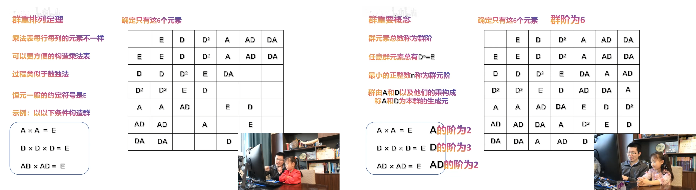

# linear-algebra

- Reference

  [MIT18.06-linear-algebra (Gilbert Strang)](https://web.mit.edu/18.06/www/)


- Overview

  Vector spaces

  Linear transformations

  Orthogonality

  Eigen-analysis


## Prepare

### System of linear equations

- Three ways to express the equation
  $$
  \text{Linear Equation: }
  
  \left\{\begin{matrix}
  2x_1 + x_2 = 7 \\
  -3x_1 + 4x_2 = -5
  \end{matrix}\right.
  
  \\
  
  \text{Vector Equation: }
  
  \begin{bmatrix}
  2x_1 + x_2 \\
  -3x_1 + 4x_2
  \end{bmatrix}
  =
  \begin{bmatrix}
  7 \\
  -5
  \end{bmatrix}
  
  \Longrightarrow
  \\
  
  \begin{bmatrix}
  2x_1 \\
  -3x_1
  \end{bmatrix}
  +
  \begin{bmatrix}
  x_2 \\
  4x_2
  \end{bmatrix}
  =
  \begin{bmatrix}
  7 \\
  -5
  \end{bmatrix}
  
  \Longrightarrow
  
  x_1
  \begin{bmatrix}
  2 \\
  -3
  \end{bmatrix}
  +
  x_2
  \begin{bmatrix}
  1 \\
  4
  \end{bmatrix}
  =
  \begin{bmatrix}
  7 \\
  -5
  \end{bmatrix}
  
  \\
  
  \text{Matrix Equation: }
  
  \begin{bmatrix}
  2& 1\\
  -3& 4
  \end{bmatrix}
  \begin{bmatrix}
  x_1 \\
  x_2
  \end{bmatrix}
  =
  \begin{bmatrix}
  7 \\
  -5
  \end{bmatrix}
  
  \Longrightarrow
  
  AX=b
  $$
  
- Need definition: Basis vector operations
  $$
  \text{Vector addition:} \space
  
  \begin{bmatrix}
  2 \\
  -3
  \end{bmatrix}
  +
  \begin{bmatrix}
  1 \\
  4
  \end{bmatrix}
  =
  \begin{bmatrix}
  3 \\
  1
  \end{bmatrix}
  
  \\
  
  \text{Scalar multiplication:} \space
  
  3
  \begin{bmatrix}
  2 \\
  -3
  \end{bmatrix}
  =
  \begin{bmatrix}
  6 \\
  -9
  \end{bmatrix}
  
  \\
  \Longrightarrow
  \text{Linear combination of columns:} \space
  3 col_1 + 1 col_2 = 
  \begin{bmatrix}
  7 \\
  -5
  \end{bmatrix}
  $$

- Need definition: Matrix-vector Multiplication
  $$
  \text{By rows (to linear eqs):}
  
  \begin{bmatrix}
  2& 1\\
  -3& 4
  \end{bmatrix}
  \begin{bmatrix}
  x_1 \\
  x_2
  \end{bmatrix}
  =
  \begin{bmatrix}
  2x_1 + x_2 \\
  -3x_1 + 4x_2
  \end{bmatrix}
  
  \\
  
  \text{By columns (to vector eqs):}
  
  \begin{bmatrix}
  2& 1\\
  -3& 4
  \end{bmatrix}
  \begin{bmatrix}
  x_1 \\
  x_2
  \end{bmatrix}
  =
  x_1
  \begin{bmatrix}
  2 \\
  -3
  \end{bmatrix}
  +
  x_2
  \begin{bmatrix}
  1 \\
  4
  \end{bmatrix}
  $$
  


---

- Two types of picture

  Row picture: find intersection

  Column picture: find coefficient!!!


# MIT18.06-linear-algebra (Gilbert Strang)

## Part 1

### The Geometry of Linear Equations


### Elimination with Matrices


### Multiplication and Inverse Matrices


### Factorization into A = LU


### Transposes, Permutations, Spaces R^n


### Column Space and Nullspace 


### Solving Ax = 0: Pivot Variables, Special Solutions 


### Solving Ax = b: Row Reduced Form R


### Independence, Basis, and Dimension 


### The Four Fundamental Subspaces


### Matrix Spaces; Rank 1; Small World Graphs


### Graphs, Networks, Incidence Matrices


### Quiz 1 Review


## Part 2

### Orthogonal Vectors and Subspaces


### Projections onto Subspaces


### Projection Matrices and Least Square


### Orthogonal Matrices and Gram-Schmidt


### Properties of Determinants


### Determinant Formulas and Cofactors


### Cramer's Rule, Inverse Matrix, and Volume


### Eigenvalues and Eigenvectors


### Diagonalization and Powers of A 


### Differential Equations and exp(At)


### Markov Matrices; Fourier Series


### Quiz 2 Review 


## Part 3

### Symmetric Matrices and Positive Definiteness


### Complex Matrices; Fast Fourier Transform 


### Positive Definite Matrices and Minima 


### Similar Matrices and Jordan Form


### Singular Value Decomposition


### Linear Transformations and Their Matrices 


### Change of Basis; Image Compression


### Quiz 3 Review


### Left and Right Inverses; Pseudoinverse


### Final Course Review


# linear-algebra (zhicheng zhou)

## Prepare

### System of linear equations


### Elimination


### Elimination using matrix multiplications


### Matrix algebra


### Inverse matrix


### Factorization A=LU


### Block matrix


## Vector spaces

### Vector space and subspace


### Column space and nullspace


### Reduced row echelon form


### General solutions to Ax=b


### Properties of vector space


### Four fundanmental subspace of A


## Linear transformations

### Introduction to linear transformations


### Language of transformations


## Orthogonality


## Eigen-analysis


# linear-algebra (nina)


# abstract-algebra (nina)


# abstract-algebra (ssxy-mini)

## 置换操作

- Example: 正三角形 (1,2,3)

  (1,2,3)  不旋转

  (3,1,2)  中心旋转 $\frac{2\pi}{3}$ 

  (2,3,1)  中心旋转 $\frac{4\pi}{3}$ 

  (2,1,3)  3轴旋转 $\pi$ 

  (3,2,1)  2轴旋转 $\pi$ 

  (1,3,2)  1轴旋转 $\pi$ 

  旋转操作：把三个点位置重新排列，称之为 `置换`

  


---

- Example: 两根 (1,2)

  二根置换有 $2$ 个元素

  ```
  (1,2)  
  (2,1)  
  ```

- Example: 三根 (1,2,3)

  三根置换有 $2*3=6$ 个元素

  ```
  (,1,2), (1,,2), (1,2,)
  (,2,1), (2,,1), (2,1,)
  ```

- Example: 四根 (1,2,3,4)

  四根置换有 $6*4=24$ 个元素

  ```
  (,3,1,2), (3,,1,2), (3,1,,2), (3,1,2,)
  (,1,3,2), (1,,3,2), (1,3,,2), (1,3,2,)
  (,1,2,3), (1,,2,3), (1,2,,3), (1,2,3,)
  
  (,3,2,1), (3,,2,1), (3,2,,1), (3,2,1,)
  (,2,3,1), (2,,3,1), (2,3,,1), (2,3,1,)
  (,2,1,3), (2,,1,3), (2,1,,3), (2,1,3,)
  ```

  


## 群的四个性质

- 群的构成

  集合 + 运算 + 公理

- 群的乘法

  置换群的乘法为 置换操作

  旋转群的乘法为 旋转操作

  


---

- 群的四个性质

- **封闭性**：任意两个元素的乘，仍是群内元素
  $$
  (3,1,2)*(3,1,2)=(2,3,1)
  
  \\
  
  (2,3,1)*(2,3,1)=(3,1,2)
  $$

- **结合性**：乘没有顺序 $(A*B)*C=A*(B*C)$ 
  $$
  (3,1,2)*(3,2,1)*(2,1,3)=(2,1,3)*(2,1,3)=(1,2,3)
  
  \\
  
  (3,1,2)*(3,2,1)*(2,1,3)=(3,1,2)*(2,3,1)=(1,2,3)
  $$
  

  群乘法 没有交换性 (交换不一定成立)
  $$
  \text{逆元可交换：}
  
  (3,1,2)*(2,3,1)=(1,2,3)
  
  \\
  
  (2,3,1)*(3,1,2)=(1,2,3)
  
  \\
  
  \text{普通元不可交换：}
  
  (3,1,2)*(2,1,3)=(1,3,2)
  
  \\
  
  (2,1,3)*(3,1,2)=(3,2,1)
  $$

- **恒元**：对任意元素A，存在单位元 $E$，st $A*E=A$
  $$
  (1,2,3)=E
  
  \\
  
  \text{表达含义即：不旋转}
  $$
  
- **逆元**：对任意元素A，存在A的相反元 $A^{-1}$，st $A*A^{-1}=E$
  $$
  \text{Example: }
  
  (3,1,2)*(2,3,1)=(1,2,3)
  
  \\
  
  \text{表达含义即：中心旋转120 * 中心旋转240 = 旋转回去}
  
  \\
  
  \text{Example: }
  
  (2,1,3)*(2,1,3)=(1,2,3)
  
  \\
  
  \text{表达含义即：3轴旋转180 * 3轴旋转180 = 旋转回去}
  $$
  
  
  


## 群有哪些 (群乘)

- Example：将**整数加法**定义为群乘

  构成`整数群`

  封闭性 ✔  结合性 ✔  恒元 ✔  逆元 ✔

- 对应平移操作 (*数没变 只是位置有变*)

  只考虑个位，忽略十位忽略负数，即$9+1=0$  $\Longrightarrow$  10个元素构成**循环群** (对应正多边形的旋转)

  

- EX: 三个元素 对应的三角形旋转

  


---

- Example：将**整数乘法**定义为群乘

  不构成群

  逆元 X 
  $$
  3 * \frac{1}{3} = 1 (恒元)
  
  \\
  
  \frac{1}{3} \notin 整数
  $$
  
  


- Example：将**实数乘法**定义为群乘 (+ **除0外的实数**)

  构成群

  逆元 ✔ (0 没有逆元)

- 对应伸缩操作 (*数没变 只是换了密度*)

  

- 乘法和加法的关系：指数 (以后构建李群的方式)
  $$
  4 * 8 = 2^2 * 2^3 = 2^{2+3}
  $$
  
  


## 矩阵的群

- 矩阵的线性组合 = 加法, 数乘
  $$
  \begin{bmatrix}
  4& 2\\
  5& 3
  \end{bmatrix}
  
  \begin{bmatrix}
  0& 1& 1\\
  3& 2& 2
  \end{bmatrix}
  
  =
  
  \begin{bmatrix}
  (4*0+2*3)& (...)& (...)\\
  (...)& (...)& (...)
  \end{bmatrix}
  $$
  
- Example: 将**矩阵乘法**定义为群乘 (+ **非奇异方矩阵**)

  构成群

  逆元 ✔ (奇异矩阵 无相反元)

- 旋转操作的矩阵表示
  $$
  R(\theta) 
  
  =
  
  \begin{bmatrix}
  \cos \theta& -\sin \theta\\
  \sin \theta& \cos \theta
  \end{bmatrix}
  $$
  三角形旋转的矩阵表示
  $$
  \text{不旋转：}
  
  \begin{bmatrix}
  1& 0\\
  0& 1
  \end{bmatrix}
  
  = 
  
  E
  
  \\
  
  \text{中心旋转120：}
  
  \frac{1}{2}
  
  \begin{bmatrix}
  -1& -\sqrt{3}\\
  \sqrt{3}& -1
  \end{bmatrix}
  
  = 
  
  F
  
  \\
  
  \text{中心旋转240：}
  
  \frac{1}{2}
  
  \begin{bmatrix}
  -1& \sqrt{3}\\
  -\sqrt{3}& -1
  \end{bmatrix}
  
  = 
  
  D
  
  \\
  
  \text{3轴旋转：}
  
  \begin{bmatrix}
  -1& 0\\
  0& 1
  \end{bmatrix}
  
  = 
  
  A
  
  \\
  
  \text{中心旋转120：}
  
  \frac{1}{2}
  
  \begin{bmatrix}
  1& -\sqrt{3}\\
  -\sqrt{3}& -1
  \end{bmatrix}
  
  = 
  
  B
  
  \\
  
  \text{中心旋转240：}
  
  \frac{1}{2}
  
  \begin{bmatrix}
  1& \sqrt{3}\\
  \sqrt{3}& -1
  \end{bmatrix}
  
  = 
  
  C
  $$
  
  
  


---

- 矩阵构成一个群
  $$
  E*A=A; A*E=A
  
  \\
  
  D*A=C; A*D=B
  
  \\
  
  B*A=F; A*B=D
  
  \\
  
  ...
  $$
- 群构建的乘法表

  每行没有重复元素、每列没有重复元素 (只是重排)

  后面可更方便构造乘法表，类似数独

  

  


## 群乘重排列

- 群的重排列定理

  群有元素 $\{ E,A_1,A_2,A_3,... \}$ 

  取任意一个元素 $A_k$，乘群中的所有元素，得 $\{ A_k, A_k A_1, A_k A_2, A_k A_3, ...\}$ (集合忽略顺序)
  
  $\Longrightarrow$  群中任意元素 乘群中所有元素，仍是群本身
  
  > Proof: 互相包含 不能出现两次
  
  Ex
  $$
  A * \{ E,F,D,A,B,C \}
  
  \\
  
  = \{ A,C,B,E,D,F \}
  $$
  


---

- 给定条件 (更方便构造乘法表)
  $$
  \left\{\begin{matrix}
  A*A=E \\
  D*D*D=E \\
  AD*AD=E
  \end{matrix}\right.
  $$
  列举群所有元素：$E, A, D; D^2, AD, DA$ (有且只有)
  $$
  \text{Explore (E, A, D, ...): }
  
  A*A=E
  \\
  D*D=D^2; D * D^2 = E
  \\
  A*D=AD; AD*AD=E
  \\
  D*A=DA; DA*DA... ✔
  
  \\
  
  \text{Verify (example): }
  
  AD*D^2A=A*D^3*A=A*A=E (AD,D^2A不共存)
  \\
  D^2A:\space \because AD*D^2A=E, AD*AD=E \therefore D^2A=AD
  \\
  DA*DA=D*D^2A*A=D^3*A^2=E
  \\
  D*AD*A=DA*DA=E
  \\
  AD^2*DA=A*D^3*A=E
  $$
  

  


## 子群 陪集

- 群的重要概念

  


