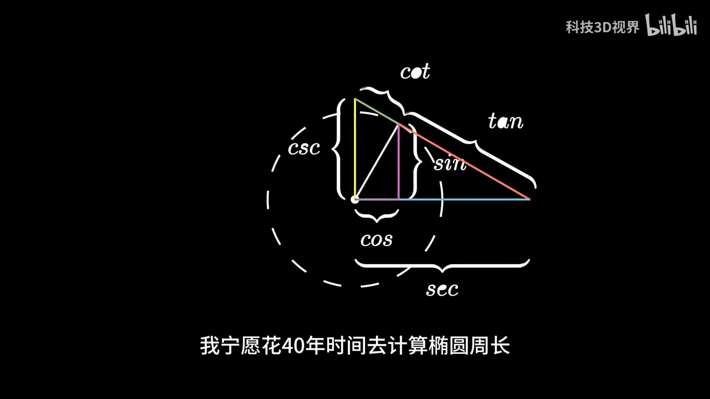

# popularization of science

- Mathematicians put up walls

  René Descartes (1596-1650, France), 

  `Isaac Newton` (1642-1727, England), `Gottfried Wilhelm Leibniz` (1646-1716, Germany), 

  `Blaise Pascal` (1623-1662, France), 

  `Pierre de Fermat` (1601-1665, France), 

  `Christiaan Huygens` (1629-1695, Netherlands), 

  `Jacob Bernoulli` (1654-1705, Switzerland), `Johann Bernoulli` (1667-1748, Switzerland), 

  `Leonhard Euler` (1707-1783, Switzerland), 

  `Joseph-Louis Lagrange` (1736-1813, Italy), 

  `Carl Friedrich Gauss` (1777-1855, Germany), 

  `Augustin-Louis Cauchy` (1789-1857, France), 

  `Joseph Fourier` (1768-1830, France), 

  `Siméon Denis Poisson` (1781-1840, France), 

  `Carl Gustav Jacob Jacobi` (1804-1851, Germany), `Niels Henrik Abel` (1802-1829, Norway), `Adrien-Marie Legendre` (1752-1833, France), 

  `Évariste Galois` (1811-1832, France), 

  `Bernhard Riemann` (1826-1866, Germany), 

  `Henri Poincaré` (1854-1912, France), 

  `Georg Cantor` (1845-1918, Germany), 

  `David Hilbert` (1862-1943, Germany), 

  `Kurt Gödel` (1906-1978, Austria), 

  `Alan Turing` (1912-1954, England), 

  [`Ramanujan`](https://zh.wikipedia.org/wiki/%E6%96%AF%E9%87%8C%E5%B0%BC%E7%93%A6%E7%91%9F%C2%B7%E6%8B%89%E9%A9%AC%E5%8A%AA%E9%87%91) (1887-1920, India), [`Godfrey Harold Hardy`](https://zh.wikipedia.org/wiki/%E6%88%88%E5%BC%97%E9%9B%B7%C2%B7%E5%93%88%E7%BD%97%E5%BE%B7%C2%B7%E5%93%88%E4%BB%A3) (1877-1947, England), [`John Edensor Littlewood`](https://zh.wikipedia.org/wiki/%E7%B4%84%E7%BF%B0%C2%B7%E6%81%A9%E7%91%9F%C2%B7%E6%9D%8E%E7%89%B9%E7%88%BE%E4%BC%8D%E5%BE%B7) (1885-1977), 

  `Andrew Wiles` (1953-, England), 


- 简介

  > 1. Blaise Pascal (1623-1662, France), 帕斯卡，概率论的早期研究者。
  > 2. Pierre de Fermat (1601-1665, France), 费马，数论和概率论的先驱。
  > 3. Christiaan Huygens (1629-1695, Netherlands), 惠更斯，微分几何的先驱之一。
  > 4. Jacob Bernoulli (1654-1705, Switzerland), 雅各布·伯努利，概率论和微积分的早期贡献者。
  > 5. Johann Bernoulli (1667-1748, Switzerland), 约翰·伯努利，微积分和流体力学的重要人物。
  > 6. Leonhard Euler (1707-1783, Switzerland), 欧拉，数学的多产贡献者，包括数论和图论。
  > 7. Joseph Fourier (1768-1830, France), 傅里叶，傅里叶分析的创始人。
  > 8. Adrien-Marie Legendre (1752-1833, France), 勒让德，数论和椭圆函数的重要贡献者。
  > 9. Siméon Denis Poisson (1781-1840, France), 泊松，概率论和数学物理的重要人物。
  > 10. Niels Henrik Abel (1802-1829, Norway), 阿贝尔，阿贝尔函数和群论的先驱。
  > 11. Augustin-Louis Cauchy (1789-1857, France), 柯西，分析学和数学分析的奠基人之一。
  > 12. Carl Gustav Jacob Jacobi (1804-1851, Germany), 雅可比，数学分析和数论的重要贡献者。
  > 13. George Boole (1815-1864, England), 布尔，布尔代数和逻辑代数的创始人。
  > 14. Arthur Cayley (1821-1895, England), 凯莱，代数学和矩阵理论的奠基人。
  > 15. James Joseph Sylvester (1814-1897, England), 西尔维斯特，代数学和矩阵理论的重要贡献者。
  > 16. Charles Hermite (1822-1901, France), 埃尔米特，代数数论和非欧几何的先驱。
  > 17. William Kingdon Clifford (1845-1879, England), 克利福德，几何学和代数学的重要人物。
  > 18. Sofia Kovalevskaya (1850-1891, Russia), 索菲亚·柯瓦列夫斯卡娅，第一位女数学博士和数学家。
  > 19. Henri Poincaré (1854-1912, France), 庞加莱，拓扑学和微分方程的奠基人。
  > 20. Giuseppe Peano (1858-1932, Italy), 皮亚诺，数学逻辑和符号逻辑的先驱。
  > 21. David Hilbert (1862-1943, Germany), 希尔伯特，数学的多个分支的重要贡献者。
  > 22. Ernst Zermelo (1871-1953, Germany), 策梅洛，集合论和逻辑学的重要人物。
  > 23. L.E.J. Brouwer (1881-1966, Netherlands), 布劳威尔，直觉主义数学和拓扑学的奠基人。
  > 24. Norbert Wiener (1894-1964, USA), 诺伯特·维纳，控制论和信息论的创始人。
  > 25. John von Neumann (1903-1957, Hungary/USA), 冯·诺依曼，博弈论和量子力学的先驱。
  > 26. Kurt Gödel (1906-1978, Austria), 哥德尔，数理逻辑和集合论的先驱。
  > 27. Paul Erdős (1913-1996, Hungary), 埃尔德什，图论和概率论的杰出贡献者。
  > 28. Alan Turing (1912-1954, England), 图灵，计算机科学的奠基人，对数理逻辑有重要贡献。
  > 29. Claude Shannon (1916-2001, USA), 香农，信息论的创始人。
  > 30. Richard Feynman (1918-1988, USA), 费曼，量子力学和粒子物理学的重要人物。
  > 31. John Forbes Nash Jr. (1928-2015, USA), 约翰·纳什，纳什均衡的提出者，博弈论的重要贡献者。
  > 32. Stephen Smale (1930-2020, USA), 斯梅尔，拓扑学和动力系统的先驱。
  > 33. Andrew Wiles (1953-, England), 威尔斯，费马大定理的证明者。
  > 34. Grigori Perelman (1966-, Russia), 佩雷尔曼，庞加莱猜想的证明者。
  > 35. Terence Tao (1975-, Australia/USA), 陶哲轩，数学分析和偏微分方程的杰出贡献者。
  > 36. Timothy Gowers (1963-, England), 高尔斯，组合数学和数学竞赛的杰出贡献者。
  > 37. Cedric Villani (1973-, France), 维拉尼，偏微分方程和数学物理的杰出贡献者。
  > 38. Maryam Mirzakhani (1977-2017, Iran/USA), 米扎卡尼，首位获得菲尔兹奖的女性数学家。
  > 39. Peter Scholze (1987-, Germany), 施尔策，代数几何和数学物理的杰出贡献者。
  > 40. Akshay Venkatesh (1981-, Australia/USA), 温卡特什，数论和代数几何的杰出贡献者。
  >


- 行业黑话

  数学界三鼎皇冠：菲尔兹奖、阿贝尔奖、沃尔夫奖


## The history of calculus

- 以爱之名，笛卡尔心形曲线的复平面解析


- 起于因式分解，终于存在之问，但其实并没有终结


- 在数学定义下自由生长，一场扩域的游戏


- 简单实现FFT：快速傅立叶变换


- 从虚无到真实，复分析的缘起之路


复变函数，从无法展示到花样变换


离散傅立叶变换应用实例：图像处理-DFT


以欧拉之名，回看e之缘起


四元数上的欧拉公式，来自哈密顿同学的托玛斯大全旋


离散傅立叶变换：上帝视角，从零打造-DFT1.2万4-18


时空中的四元数，以及哈密顿的自我救赎6.2万4-14


### Ramanujan and Recursion

- 拉玛努金，天生以神之思维

- **循环**：迭代、递归 

  递归跳出了人类的思维方式 ([Peter Deutsch](https://zh.wikipedia.org/wiki/%E5%BD%BC%E5%BE%97%C2%B7%E5%A4%9A%E4%BC%8A%E5%A5%87))

  **迭代**：十进制，以10为周期进行的迭代；十二刻度，替代无数次日出日落 (闰年)

  **递归**：原子弹爆炸 (递归循环导致核链反应)；Fibonacci sequence 

- Fibonacci sequence  

  无限地调用自己

  $$
  f(n)=f(n-2)+f(n-1)
  
  \\
  
  f(n)=f(n-4)+f(n-3)+f(n-3)+f(n-2)
  
  \\
  
  f(n)=f(n-6)+f(n-5)+f(n-5)+f(n-4)+f(n-5)+f(n-4)+f(n-4)+f(n-3)
  $$
  
- Ramanujan's formula

  根号里的内容视为函数 函数在不断地调用自己 

  $$
  \sqrt{1+2\sqrt{1+3\sqrt{1+4\sqrt{...} } } } = 3
  $$
  
  
  转化为代数表达式
  
  $n(n+2)=n\sqrt{1+(n+1)(n+3)}$
  
  > Proof: Expand, Factor
  >
  > $1+(n+1)(n+3)=n^2+4n+4=(n+2)^2$
  >
  > $\sqrt{1+(n+1)(n+3)}=(n+2)$
  >
  > $n(n+2)=n\sqrt{1+(n+1)(n+3)}$
  
  $f(n)=n(n+2)$, $f(n)=n\sqrt{1+(n+1)(n+3)}$; 
  
  $(n+1)(n+3)=f(n+1)$  $\Rightarrow$  $f(n)=n\sqrt{1+f(n+1)}$ 
  
  When $n=1...\infty$, $f(1)=1\sqrt{1+f(2)}$, $f(2)=2\sqrt{1+f(3)}$, $f(3)=3\sqrt{1+f(4)}$, ...
  
  then $f(n)=\sqrt{1+2\sqrt{1+3\sqrt{1+ ...}}}$ 
  
  Calculate the limit of this expression: $n(n+2)=3$
  
  


### Ramanujan 

- 机器生成数学公式？拉玛努金的狂野之梦


### Elliptic Integral

- 椭圆积分，延续百年的迷题，以及知无涯者的花火

- 圆和椭圆的相似

  半径：r; a b

  标准方程： $\frac{x^2}{r^2} + \frac{y^2}{r^2} = 1$ ; $\frac{x^2}{a^2} + \frac{y^2}{b^2} = 1$ 

  面积：$\pi r r$; $\pi a b$ (某个矩形面积的一个折算比例!!! $\pi$)

  周长：$\pi (r+r)$; ???

- 椭圆周长没有公式 (Legendre)

  曲线长度公式：找到一个计算任意曲线长度的方法 连续曲线分割求解 (将曲线视为无数个小线段组成 然后再取极限/积分)

  > 小线段的长度：$(ds)^2=(dx)^2+(dy)^2$; $dy=f^{\prime}(x) * dx$   
  >
  > 积分：$s = \int \sqrt{(dx)^2+[f^{\prime}(x) * dx]^2} dx$  $\Rightarrow$  $s = \int \sqrt{1+[f^{\prime}(x)]^2} dx$  ???

  带入椭圆：... $4a \int_0^1 \frac{1-\varepsilon ^2 x^2}{\sqrt{1- \varepsilon^2 x^2} \sqrt{1 - x^2}} dx$ (椭圆积分 该积分不能用初等代数式表示 超越函数)

- 算椭圆周长

  近似公式：$\pi (a+b)$ - 精度拉跨

  Ramanujan
  $$
  s = \pi (a+b) \frac{1+3\lambda }{1= + \sqrt{4-3\lambda } } 
  
  \\
  
  \lambda (\frac{a-b}{a+b})^2
  $$
  
- 计算机怎么计算的

  **无穷级数**是捕捉超越数的工具
  $$
  \pi(a+b)(1+\frac{\pi}{4}+\frac{h^2}{64}+\frac{h^3}{256}+\frac{25h^4}{16384}+...)  
  
  \\
  
  h = (\frac{a-b}{a+b})^2
  $$
  


### Abel

- 数之灵阿贝尔：“有关数学和人生，我只教一次

  开创了椭圆函数学

  证明了五次方程 无根式解

  严格微积分的发起人之一

- 研究问题

  单位圆上变化出的三角函数

  半个世纪的椭圆周长问题 (Jacobi, Abel) -> 在椭圆上建立类似三角函数

  

- Abel 之前的研究 

  关注点在椭圆的周长问题，得出各种类型的椭圆积分 

  椭圆积分对应的是超越函数，没有有限次的代数表达式
  $$
  \text{First Kind Elliptic Integral: } F(\phi, k) = \int_0^\phi \frac{d\theta}{\sqrt{1 - k^2 \sin^2(\theta)}}
  
  \\
  
  \text{Second Kind Elliptic Integral: } E(\phi, k) = \int_0^\phi \sqrt{1 - k^2 \sin^2(\theta)} \, d\theta
  
  \\
  
  \text{Third Kind Elliptic Integral: } \Pi(n, \phi, k) = \int_0^\phi \frac{d\theta}{(1 - n \sin^2(\theta)) \sqrt{1 - k^2 \sin^2(\theta)}}
  $$
  
- Abel 的研究

  椭圆积分的本质 

  椭圆的两个焦点无限靠近 变成圆 $\int_0^x \frac{dt}{\sqrt{(1-t^2)}} = \arcsin(x) = \theta $ 
  
  椭圆积分的结果相当于圆周上的角度 -> 定义类似正余弦的函数
  
  ```
  圆 cos(x) sin(x)  三角函数
  
  椭圆 cn(x) sn(x)  椭圆函数 (双周期函数)
  
  
  平方和等于1
  和差公式、倍角公式、欧拉公式
  
  复数域观察发现
  在实轴和虚轴都呈现出周期性 
  
  ```
  
- Jacobi 椭圆函数的具体定义 
  $$
  \text{把椭圆积分的结果标记为: } u = \int_{c}^{x} R(t, \sqrt{P(t)}) dt  
  
  \\
  
  \text{规定常数: } k = \sqrt{1 - \frac{b^2}{b^2}}
  
  \\ 
  
  \text{定义出类似 } cos \text{ 的椭圆函数: } Cn(u,k)
  
  \\
  
  \text{定义出类似 } sin \text{ 的椭圆函数: } Sn(u,k)
  $$

- 椭圆函数的价值

  椭圆积分 -> 椭圆函数 -> 椭圆曲线 -> 怀尔斯证明费马大定理

  (对于数学家而言 让他们想研究啥就研究啥 就行了)


用Mathematica推导泰勒公式_理论+实操2.4万4-2


不存在平行线？高斯的测地线，以及第一基本形31.5万3-29


欧拉的素数养成计划，费马的素数养成计划，就问哪家强？21.6万3-26


用Mathematica学微积分，实操与干货2.2万3-25


黎曼猜想，到底猜了个啥？48.3万3-20


罗巴切夫斯基的巨大三角形，几何学的革命26.7万3-15


高斯的执念，细思极恐的低维空间，以及微分几何的缘起时刻78万3-11


连续但处处不可导，魏尔斯特拉斯函数，严谨数学下的妖兽111.8万3-6


柯西数列，成全了微积分的一个定义，以及实数域的自我救赎31.5万2-20


一人一公式，以天才之名。从拉格朗日到高斯30.5万2-16


一人一公式，以智者之名49.8万2-12


超越想象的立方级数，以及以数学为秘旨的暗黑组织16.9万2-6


数学史上的高光时刻，从欧几里德，到迪卡尔17.5万2-4


图论欧拉公式，从散步迷题引出的数学分支11.8万1-31


伪欧空间，到底有多伪？闵氏几何的度量基础


双曲余弦，由一个奇怪轮子引出的优美方程式12.1万1-20


双曲函数，来自一条争议之链的超级函数55.4万1-16


数学家最关键能力，你的数商有几分？28.5万1-12


离散傅利叶变换，强大的人工智能算法，DFT由来之路23.6万1-10


天才的秀场，代数基本定理17.7万1-4


太极图的数学起源，以及反正切函数的解析表达10.1万2023-12-31


欧拉公式的变换，闪电破解棣莫弗公式56.1万2023-12-27


欧拉的魔法之剑，从弧度定义到上帝公式163.5万2023-12-21


那些奇怪的三角函数哟，都被关在单位圆里20.5万2023-12-19


这个世界真实吗？贝尔不等式18.1万2023-12-16


随机变量的花样理解，莫斯科学派的荣光5.8万2023-12-14


谎言的森林，重复博弈中的混合策略52.6万2023-12-9


弱者的纳什均衡。大猪小猪落玉盘？139.7万2023-12-5


聪明人悖论，多重逻辑下的陷阱，原来确实想多了87.9万2023-11-30


随机密码，破解香农熵，我们是擅长消除混乱的88.6万2023-11-24


中值理论，线性回归，以及股圈中的量化操作14.5万2023-11-19


凯利公式，以及一个横扫股圈的男人113.4万2023-11-12


最大似然假设，以及命运中的巧合7.9万2023-11-9


拉姆齐结界，以及生日迷题22.4万2023-11-4


泊松分布，无穷分割玩的魔术8.4万2023-10-31


狂野的正态分布，以及丛林法则47万2023-10-25


命运的子弹，幸存者偏差98万2023-10-18


截胡欧拉，暴力推导第二积分式24.4万2023-10-14


欧拉的神作，伽玛函数，以及哥德巴赫猜想64.9万2023-10-11


注定孤独的宇宙，几何分布，以及墨菲定律96.7万2023-10-4


谷神星的神谕，高斯积分10.2万2023-9-28


随机漫步，高斯手中的蚂蚁135.7万2023-9-21


唐僧的决择，贝叶斯概率的魔术9万2023-9-14


命运窃贼，在伯努利序列里偷点运气23.6万2023-9-10


概率的尽头，是命运吗？


线性空间，到底能有多空？17.9万2023-9-1


时空不变量，闵可夫斯基的救赎24.5万2023-8-25


二次曲面，神秘的洛书矩阵16.6万2023-8-18


降维矩阵，数学二向箔31.7万2023-8-11


高阶变换，希尔伯特空间49.8万2023-8-4


所以距离是投影？内积空间的秘密9.4万2023-7-29


洛伦兹变换，相对论中的数学10万2023-7-23


九韶之术，南宋惊天矩阵15.5万2023-7-18


矢量空间，打开高维任意门25万2023-7-14


傅立叶、拉普拉斯，用积分变换扭转视界46.5万2023-7-8


拉普拉斯变换，仙女的数学模型22.5万2023-7-4


康托尔集合，无穷的尽头是鬼怪吗？62.5万2023-6-28


傅立叶级数，无穷宇宙中的旋转


